# Istio + Keycloak 請求級身份驗證與授權專案

本專案示範如何在 Kubernetes 環境中使用 **Istio 服務網格** 和 **Keycloak** 實現企業級的請求級身份驗證與授權，包含 **mTLS + JWT 雙重認證機制**。

## 🚀 專案特色

- **雙重安全防護**: mTLS + JWT 防止服務入侵橫向擴散
- **現代化架構**: Spring Boot 3.5.4 + GraalVM Native Image 支持
- **細粒度授權**: 基於 JWT Claims 的角色權限控制
- **生產就緒**: 包含健康檢查、監控和故障排除指南
- **完整文檔**: 涵蓋安全分析、最佳實踐和實際部署經驗

## 🏗️ 架構概述

```
┌─────────────────┐    mTLS+JWT    ┌─────────────────┐    ┌─────────────────┐
│   Client Apps   │ ──────────────→│  Istio Gateway  │───→│   Book Service  │
└─────────────────┘                └─────────────────┘    └─────────────────┘
                                            │                        │
                                            ▼                        ▼
                                   ┌─────────────────┐    ┌─────────────────┐
                                   │    Keycloak     │    │   MySQL DB      │
                                   │  (JWT Issuer)   │    │  (Data Store)   │
                                   └─────────────────┘    └─────────────────┘
```

**核心組件**:
- **Spring Boot 3.5.4**: 高性能微服務框架
- **Istio Service Mesh**: 提供 mTLS、JWT 驗證和授權策略  
- **Keycloak**: 開源身份認證和訪問管理
- **Kind + MetalLB**: 本地 Kubernetes 開發環境
- **GraalVM Native Image**: 輕量化容器鏡像支持

## 🔐 安全特性

### mTLS + JWT 雙重認證
- **傳輸層安全**: Istio mTLS 確保服務間通信加密
- **應用層認證**: JWT token 驗證和細粒度授權
- **防入侵擴散**: 即使單一服務被入侵，也無法橫向訪問其他服務

### 角色權限控制
- **管理員權限**: 可以查看和添加書籍 (`admin` 角色)
- **普通用戶**: 只能查看書籍 (`user` 角色)
- **JWT Claims 驗證**: 基於 `realm_access.roles` 進行授權

### 安全配置亮點
- **JWT Audiences 控制**: 防止 token 跨服務濫用
- **ServiceAccount 隔離**: 每個服務使用專用的 Kubernetes SA  
- **AND 邏輯授權**: 修正了常見的 OR 邏輯安全漏洞

## 什麼是請求層級的身份驗證和授權？

大多數應用程式使用現代 Web 框架，並提供一個或多個 API 端點，以允許使用者、程式和其他應用程式存取您的應用程式。這些 API 端點提供以下功能：

- 允許您的應用程式使用者透過瀏覽器或行動應用程式存取您伺服器上的資料。
- 最終用戶和其他程式可以透過程式設計方式存取您的應用程式管理的資料。
- 啟用並管理應用程式不同服務之間的通訊。

如果未經授權的使用者存取這些 API 端點，則可能會被濫用或誤用。您的應用程式應該建立相應的機制來對最終使用者進行身份驗證和授權，並且僅允許存取經過身份驗證的請求。

驗證每個請求所攜帶的憑證的過程稱為請求級身份驗證。請求級授權是根據請求中憑證的合法性允許存取資源的過程。

最受歡迎的請求層級身份驗證和授權方法之一是 JWT（JSON Web Token）身份驗證。

## JWT（JSON Web Token）身份驗證

[JSON Web Token](https://jwt.io/introduction) (JWT) 是一種流行的開源身份驗證標準，它定義了一種以 JSON 物件形式在各方之間安全地傳輸資料的全面方法。由於各方之間共享的資訊使用強大的加密機制進行數位簽名，因此可以驗證和信任。

JSON Web Tokens（JWT）由三個部分組成：

- **標頭：** 它指定用於加密令牌內容的演算法。
- **有效載荷：** 它包含令牌安全傳輸的信息，也稱為聲明。
- **簽名：** 用於驗證有效載荷的真實性。

您可以閱讀有關 [JWT 令牌](https://jwt.io/introduction) 的更多資訊。

## Istio 和 JWT
 
[Istio](https://istio.io/latest/about/service-mesh/) 是最受歡迎且應用最廣泛的服務網格之一。它擁有眾多功能，可幫助您有效率地監控和保護服務。從安全角度來看，一項至關重要的功能是能夠驗證附加到最終用戶請求的 JWT。

在最終用戶請求到達您的應用程式之前，Istio 將：

- 驗證並確認 JWT 附加到最終用戶請求。
- 僅將經過身份驗證的請求轉發給應用程式。
- 拒絕存取未經身份驗證的請求。


Istio 的安全功能對於從應用程式程式碼中卸載身份驗證和授權邏輯非常有用，無需考慮自己編寫身份驗證程式碼， Istio 將透過驗證請求標頭中存在的 JWT 令牌來管理身分驗證部分。

有許多可用的身份驗證提供程序，您可以根據專案需求選擇其中任何一個，以下是一些支援 JWT 的常用身份驗證提供者。

- [Auth0](https://auth0.com/) ：Auth0 是最受歡迎且最成熟的身份驗證提供者，可用於整合您的應用程式進行身份驗證和授權。 Auth0 還提供免費套餐，涵蓋了應用程式身份驗證和授權所需的大部分功能。
- [Firebase Auth](https://firebase.google.com/docs/auth) ：Firebase Auth 是另一個受歡迎的身份驗證服務供應商，可讓您為應用程式新增身分驗證和授權。 Firebase 可讓您新增登入方法，例如身分提供者（包括 Google、Facebook、電子郵件和密碼以及電話號碼）。
- [Google Auth](https://developers.google.com/identity/openid-connect/openid-connect) ：Google OIDC 是知名的身份驗證提供者之一，您可以使用它進行身份驗證和授權。
- [KeyCloak](https://www.keycloak.org/) ：Keycloak 是一個受歡迎的開源身分驗證服務提供者。 Keycloak 提供了典型身分驗證服務提供者的所有功能。 Keycloak 的設定和使用非常簡單，我們將在這Lab中介紹使用。

|  | **Open Source** | **SSO Support** | **JWT Support** |
| --- | --- | --- | --- |
| Auth0 | No | Yes | Yes |
| Firebase Auth | No | Yes | Yes |
| Google Auth | No | Yes | Yes |
| Keycloak | Yes | Yes | Yes |

## 什麼是 Keycloak？

[Keycloak](https://www.keycloak.org/) 是一個開源身分驗證服務提供者和身分與存取管理工具，可讓您為應用程式新增身分驗證和授權，它提供所有原生身份驗證功能，包括使用者聯合、SSO、OIDC、使用者管理和細粒度授權。

## Istio 請求認證和授權

在 Istio 中， [RequestAuthentication](https://istio.io/latest/docs/reference/config/security/request_authentication/) 用於最終用戶身份驗證，它是一種自定義資源，定義了用於驗證附加到請求的憑證的方法， Istio 透過驗證附加到請求的 JWT 來執行請求層級的身份驗證。

RequestAuthentication 允許我們為網格中執行的工作負載建立驗證策略，並定義用於驗證 JWT 的規則。根據配置的身份驗證規則，Istio 將拒絕或接受最終使用者請求。

Istio允許我們限制只經過身份驗證的請求可對應用程式資源的訪問，因此至關重要。

## 使用 Istio 和 Keycloak 實現請求級身份驗證和授權

在上一節中，我們了解了什麼是請求級身份驗證和授權，以及 Istio 如何支援 JWT 驗證，現在，我們將使用 Istio 和 Keycloak 來實現它。

### 先決條件

- Kubernetes 叢集：我們將使用 Kind 另安裝了 Cloud Provider Kind 作為實驗 K8s + Istio 平台。了解 [實作：KinD + Cloud Provider Kind](https://blog.yangjerry.tw/cloud-provider-kind-load-balancer/) 。
  ```
  kind create cluster --config=istio-keycloak/kind.yml
  ```
  接著在另一個終端機，啟動 Cloud Provider Kind程式。
- 示範應用程式：將參考 [book-info應用程式](https://github.com/infracloudio/istio-keycloak/tree/master) 。

### 安裝 Istio
 
在 Kubernetes 叢集上安裝 Istio 非常簡單。有關逐步說明，您可以按照 [Istio 官方文件進行Kind安裝](https://istio.io/latest/docs/setup/platform-setup/kind/) 。

以下使依照[Helm方式安裝 Istio](https://istio.io/latest/docs/setup/install/helm/)：
```
helm repo add istio https://istio-release.storage.googleapis.com/charts
helm repo update
helm install istio-base istio/base -n istio-system --set defaultRevision=default --create-namespace
helm install istiod istio/istiod -n istio-system --wait
helm install istio-ingressgateway istio/gateway -n istio-system --wait
helm status istio-ingressgateway -n istio-system
helm get all istio-ingressgateway -n istio-system
helm status istiod -n istio-system
```

一旦 Istio 安裝並運行在您的叢集中，您就可以透過兩種方式自動 [將 Istio sidecar 注入](https://istio.io/latest/docs/setup/additional-setup/sidecar-injection/) 到您的 pod 中。

1. 可以透過為命名空間新增標籤 `istio-injection=enabled` 來為命名空間啟用 Istio sidecar 注入，這樣在該命名空間中執行的所有 pod 都會注入 Istio sidecar。
2. 可以透過在 pod 中新增標籤 `sidecar.istio.io/inject=true` 來為特定 pod 啟用 Istio sidecar 注入，該 pod 將自動注入 Istio sidecar。

### 安裝book-info範例應用程式

現在安裝 book-info 應用程式，切換到istio-keycloak目錄並安裝應用程式。

```sh
cd istio-keycloak
```

首先安裝 mysql 資料庫，等待 db pod 進入運作狀態。

```sh
kubectl apply -f app/database.yaml
kubectl get pods -w
NAME                           READY   STATUS              RESTARTS   AGE
book-info-db-598c7d9f5-m5l57   0/1     ContainerCreating   0          14s
book-info-db-598c7d9f5-m5l57   1/1     Running             0          25s
```

一旦 db pod 準備就緒，請安裝演示應用程式。

```sh
kubectl apply -f app/app.yaml
```

列出預設命名空間中的 Pod，您會在應用程式 Pod 中發現 2 個容器。這是因為我們已將 Pod 標籤設為"sidecar.istio.io/inject: "true"，從而為應用程式 Pod 啟用了 Istio Sidecar 自動注入功能，這將自動將 Istio Sidecar 注入到 book-info 應用程式的每個 Pod 中。

```sh
kubectl get pods
NAME                           READY   STATUS    RESTARTS     AGE
book-info-747f77b58-s9r88      2/2     Running   0         59s
book-info-db-598c7d9f5-m5l57   1/1     Running   0            2m39s
```

現在，我們將設定一個 Istio 網關和虛擬服務來存取該應用程式。 [網關](https://istio.io/latest/docs/reference/config/networking/gateway/) 允許我們配置來自外部系統和使用者到我們應用的入口流量。此外，Istio 閘道不包含任何流量路由配置，因此我們必須建立一個 [虛擬服務](https://istio.io/latest/docs/reference/config/networking/virtual-service/) ，將來自 Istio 閘道的流量路由到後端 Kubernetes 服務。

```sh
kubectl apply -f istio-manifests/book-info.yaml
```
 
要存取和驗證應用程序，您必須先取得 Istio 入口網關的外部 IP。

```sh
# LB_IP=$(kubectl get svc istio-ingressgateway -o=jsonpath='{.status.loadBalancer.ingress[0].ip}' -n istio-system)
```
  
列出書籍詳細信息，它將返回一個空array，因為尚未將書籍添加到資料庫中。

```sh
curl -X GET http://book-info.$LB_IP.nip.io/getbooks
[ ]
```

現在，我們將透過呼叫 addbook 端點來新增一本書。

```sh
curl -X POST -d '{"isbn": 9781982156909, "title": "The Comedy of Errors", "synopsis": "The authoritative edition of The Comedy of Errors from The Folger Shakespeare Library, the trusted and widely used Shakespeare series for students and general readers", "authorname": "William Shakespeare", "price": 10.39}' "http://book-info.$LB_IP.nip.io/addbook"
{
    "isbn": 9781982156909,
    "title": "The Comedy of Errors",
    "synopsis": "The authoritative edition of The Comedy of Errors from The Folger Shakespeare Library, the trusted and widely used Shakespeare series for students and general readers",
    "authorname": "William Shakespeare",
    "price": 10.39
}
```

現在我們再次列出書籍。這次您將找到我們剛剛新增的書籍。

```sh
curl -X GET "http://book-info.$LB_IP.nip.io/getbooks"
[
    {
        "isbn": 9781982156909,
        "title": "The Comedy of Errors",
        "synopsis": "The authoritative edition of The Comedy of Errors from The Folger Shakespeare Library, the trusted and widely used Shakespeare series for students and general readers",
        "authorname": "William Shakespeare",
        "price": 10.39
    }
]
```

### 設定 Keycloak 進行 JWT 身份驗證

目前，我們只需訪問正確的端點即可輕鬆查看和添加書籍——這意味著任何人都可以訪問該應用程式並執行相同的操作——這使其不安全，因此，我們需要一個身份驗證機制，只允許經過身份驗證的請求存取此應用程式，為此，我們將使用 Keycloak。

我們將在 Kubernetes 叢集上實作 Keycloak，並對其進行配置以頒發 JWT 令牌進行身份驗證。
 
安裝和配置 Keycloak 相當容易，可以按照官方文件了解如何 [在 Kubernetes 上安裝 Keycloak](https://www.keycloak.org/getting-started/getting-started-kube) 。

安裝 Keycloak：

```sh
kubectl apply -f keycloak/keycloak.yaml
```

列出 Pod：

```sh
kubectl get pods -l app=keycloak -w
NAME                       READY   STATUS              RESTARTS   AGE
keycloak-0   0/1     ContainerCreating   0          19s
keycloak-1   0/1     Running             0          29s
```

加上Istio 網關和虛擬服務來存取Keycloak應用程式

```sh
kubectl apply -f keycloak/keycloak-gateway.yaml
```

### 配置 Keycloak

現在，要設定 Keycloak 以發出 JWT 令牌進行身份驗證，我們使用虛擬服務的負載平衡器 IP，*$LB_IP*。

開啟您常用的瀏覽器，開啟[http://keycloak.$LB_IP.nip.io/](http://keycloak.$LB_IP.nip.io/)，歡迎頁面開啟後，點選「管理控制台」開啟登入頁面。在這裡，您可以使用預設管理員憑證（使用者名稱：admin，密碼：admin）登入。

#### 創建 realm 領域

預設情況下，Keycloak 會自備主域，但為了方便使用，我們將建立一個新的網域。您可以按照以下步驟建立新的網域。

- 點擊左上角的單字"master"，然後點擊"建立領域"。
- 在 Realm 名稱欄位中輸入 Istio。
- 按一下"建立"。
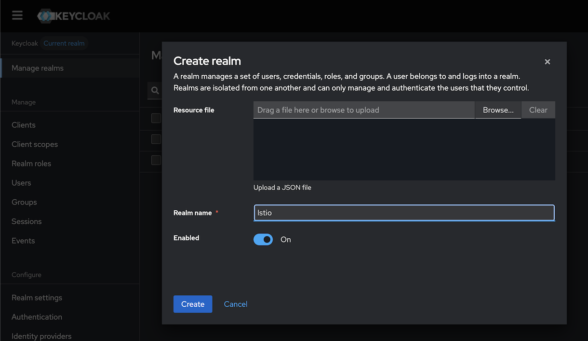

#### 建立 Oauth 用戶端

- 從左上角選擇我們剛剛建立的領域「Istio」。
- 按一下"客戶端"，然後"建立客戶端"。
- 選擇 OpenID Connect 作為客戶端類型，並將 Istio 作為客戶端 ID。新增 Istio 作為客戶端的名稱，然後按一下「下一步」。
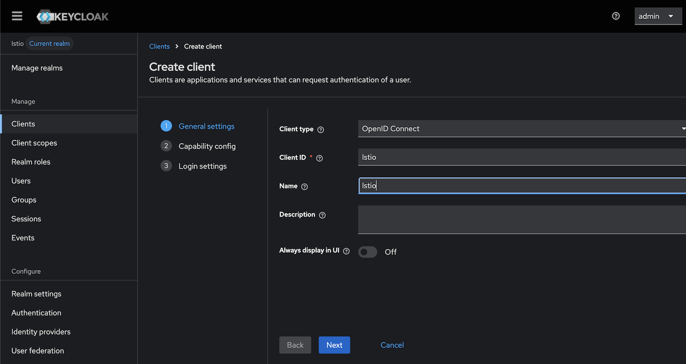
- 在第二頁，保持預設設置，點擊下一步。
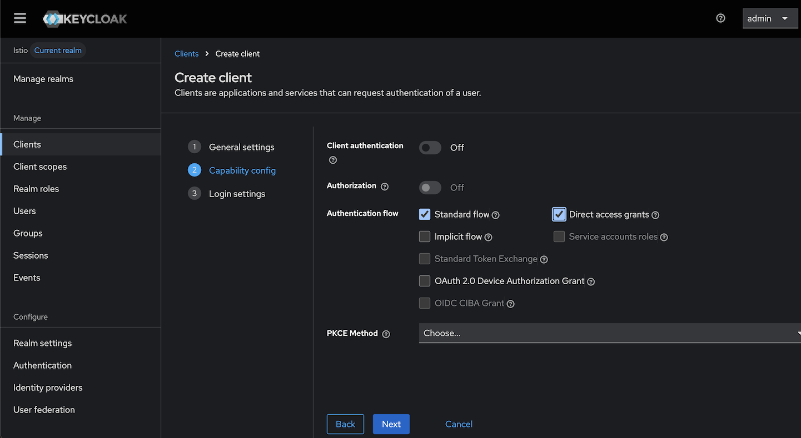
- 第三頁，同樣不要更改預設設置，按下儲存按鈕。
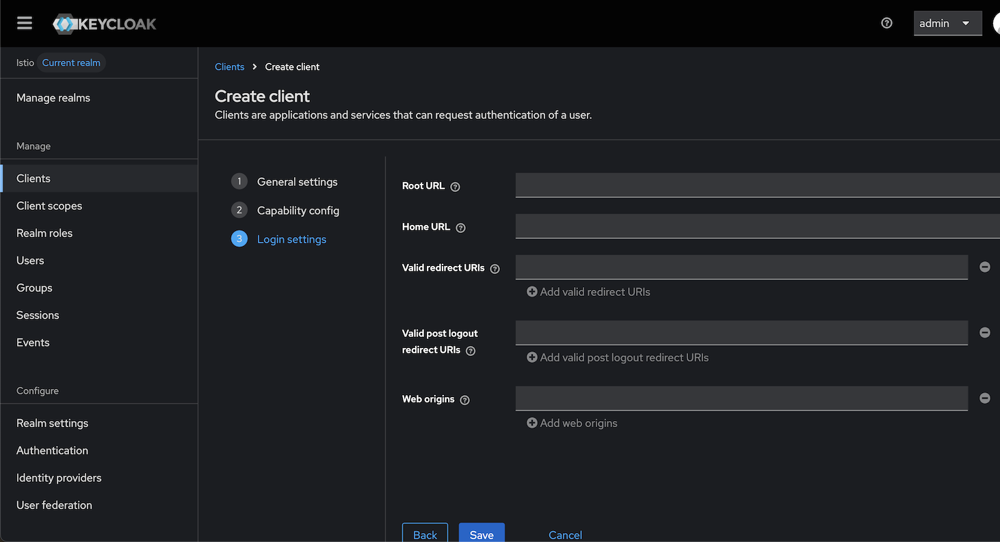

#### 創建 Roles 角色和 user 使用者
 
我們將創建兩個角色：一個是普通用戶，只能查看圖書詳情；另一個是管理員用戶，可以查看和添加圖書。同樣，我們將創建兩個用戶：一個是普通用戶，分配了用戶角色；另一個是管理員用戶，並分配了管理員角色。

##### 創建 roles 角色

- 在左側窗格中選擇"Realm roles"，然後按一下"建立角色"。輸入角色名稱"admin"，然後按一下"建立"。
- 同樣，為普通用戶創建一個角色，並將角色名稱作為"user"。

##### 創建 users 用戶

- 在左側窗格中選擇"使用者"，然後點選"新增使用者"。輸入"book-admin"作為使用者名稱。其餘值可以保留，然後點擊「建立」。
- 相同地，建立另一個用戶，用戶名為 book-user。

##### 為用戶設定密碼

一旦創建了兩個用戶，我們將為他們設定密碼。

- 在左側窗格中選擇"使用者"，然後點選"book-admin"使用者。在頂部選單中，點擊"憑證"，然後點擊"設定密碼"。輸入一個強密碼並確認。關閉「臨時」選項，最後點選「儲存」按鈕。
- 同樣的，可以為 book-user 使用者設定密碼。

##### 角色分配

- 在左側窗格中選擇"使用者"，然後點選"book-admin"使用者。在頂部選單中，選擇"角色映射"，然後點擊"分配角色"。從我們最近建立的清單中勾選「管理員」角色，然後點擊「指派」。
- 類似地，您可以為 book-user 使用者指派使用者角色。

##### 關閉 Verify Profile

- 在左側窗格下方中選擇"Authentication"，在頂部選單中，選擇"Required actions"，然後在Verify Profile的Enabled點擊"Off"，不然取得token會出現"Account is not fully set up"錯誤。


  ```sh
  curl -X POST -d "client_id=Istio" -d "username=book-user" -d "password=YOUR_PASSWD" -d "grant_type=password" "http://keycloak.172.19.0.6.nip.io/realms/Istio/protocol/openid-connect/token"
  {"error":"invalid_grant","error_description":"Account is not fully set up"}% 
  ```

### 取得所需的端點

我們需要一些端點來產生 JWT 令牌並進行 JWT 驗證。這些端點如下所示。
 
令牌 **產生 URL：http://keycloak.172.19.0.6.nip.io/realms/Istio/protocol/openid-connect/token**

令牌 **驗證 URL：http://keycloak.172.19.0.6.nip.io/realms/Istio/protocol/openid-connect/certs**

就這樣。我們已經成功設定了 Keycloak，用於為我們的演示應用程式實現請求等級的身份驗證和授權。

### Keycloak Client Credentials Flow
至於 Client credentials的設定，則可參考[OAuth 2.0 — The client credentials grant type with Keycloak](https://medium.com/@phat.tan.nguyen/oauth-2-0-the-client-credentials-grant-type-with-keycloak-2debb88a1c70)

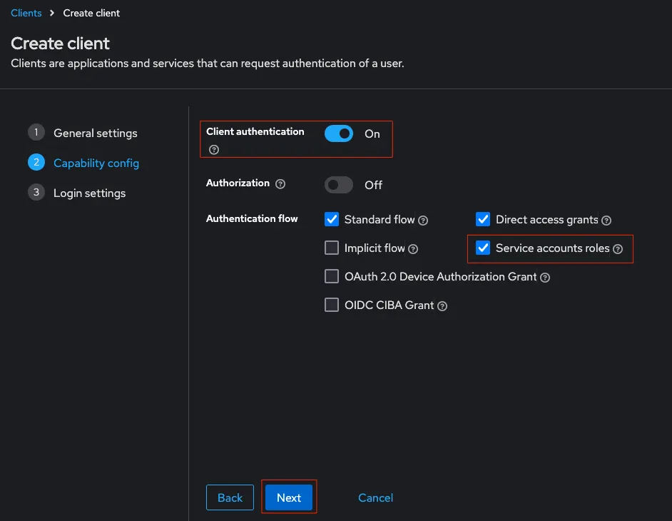

儲存後，在"Credentials"頁籤取得Client Secret，用於service 2 service情境使用。

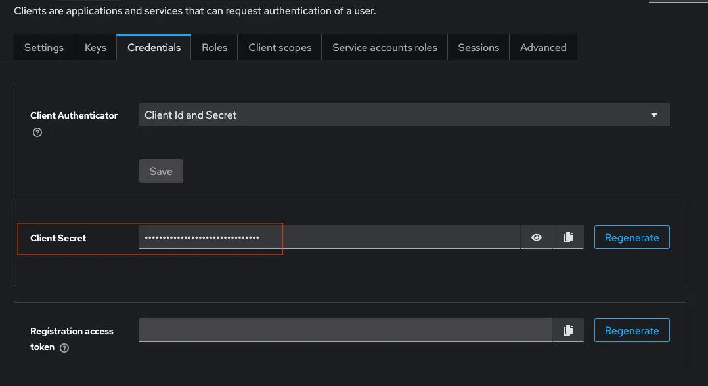

### Istio request level 身份驗證和授權

我們已經運行了一個範例 book-info 應用，並配置了 Keycloak 來頒發 JWT 令牌。現在，我們可以使用 Istio 的 RequestAuthentication 和 Authorization 策略來驗證 JWT 令牌並授權存取請求。

#### 啟用請求身份驗證

然後，我們將建立一個 RequestAuthentication 來驗證來自 Keycloak 的 JWT 令牌，現在建立一個 RequestAuthentication 來使用 Keycloak 作為頒發者來驗證 JWT 令牌。

```sh
kubectl apply -f istio-manifests/requestAuthentication.yaml
```

現在我們將嘗試存取 book-info 應用程式的 getbooks 端點。

```sh
curl -X GET http://book-info.172.19.0.6.nip.io/getbooks
[
    {
        "isbn": 9781982156909,
        "title": "The Comedy of Errors",
        "synopsis": "The authoritative edition of The Comedy of Errors from The Folger Shakespeare Library, the trusted and widely used Shakespeare series for students and general readers",
        "authorname": "William Shakespeare",
        "price": 10.39
    }
]
```

儘管已為 book-info 應用程式啟用請求身份驗證，我們仍然能夠在沒有 JWT 令牌的情況下存取該端點。發生這種情況的原因是，我們尚未建立授權策略來限制僅限經過身份驗證的請求存取。

因此，接下來我們將建立一個授權策略，AuthorizationPolicy/authorizationPolicy1.yaml。

```sh
kubectl apply -f - <<EOF
apiVersion: security.istio.io/v1beta1
kind: AuthorizationPolicy
metadata:
  name: book-info-auth
spec:
  selector:
    matchLabels:
       app: book-info
  rules:
   - from:
     - source:
         requestPrincipals: ["*"]
EOF
```

我們將嘗試存取 getbooks 端點。

```sh
curl -X GET http://book-info.172.19.0.6.nip.io/getbooks
RBAC: access denied
```

這次請求被拒絕，現在只有具有有效 JWT 的請求才被允許存取端點。

現在，讓我們嘗試透過呼叫令牌來產生端點，使用 book-user 使用者的憑證產生 JWT。

```sh
curl -X POST -d "client_id=Istio" -d "username=book-user" -d "password=YOUR_PASSWD" -d "grant_type=password" "http://keycloak.172.19.0.6.nip.io/realms/Istio/protocol/openid-connect/token"
{"access_token":"*****","expires_in":300,"refresh_expires_in":1800,"refresh_token":"*****","token_type":"Bearer","not-before-policy":0,"session_state":"382dd7d6-a440-43fc-b9f8-13f4dc84fe3f","scope":"profile email"}
```
 
複製存取權杖並在呼叫 getbooks 端點時將其用作授權承載者。

```sh
curl -X GET -H "Authorization: Bearer *****" http://book-info.172.19.0.6.nip.io/getbooks
[
    {
        "isbn": 9781982156909,
        "title": "The Comedy of Errors",
        "synopsis": "The authoritative edition of The Comedy of Errors from The Folger Shakespeare Library, the trusted and widely used Shakespeare series for students and general readers",
        "authorname": "William Shakespeare",
        "price": 10.39
    }
]
```
 
這次我們可以存取 getbooks 端點了。同樣，您可以嘗試為 book-admin 使用者產生一個令牌，然後嘗試存取 getbooks 端點。

當然，也可改用Postman，更容易操作。

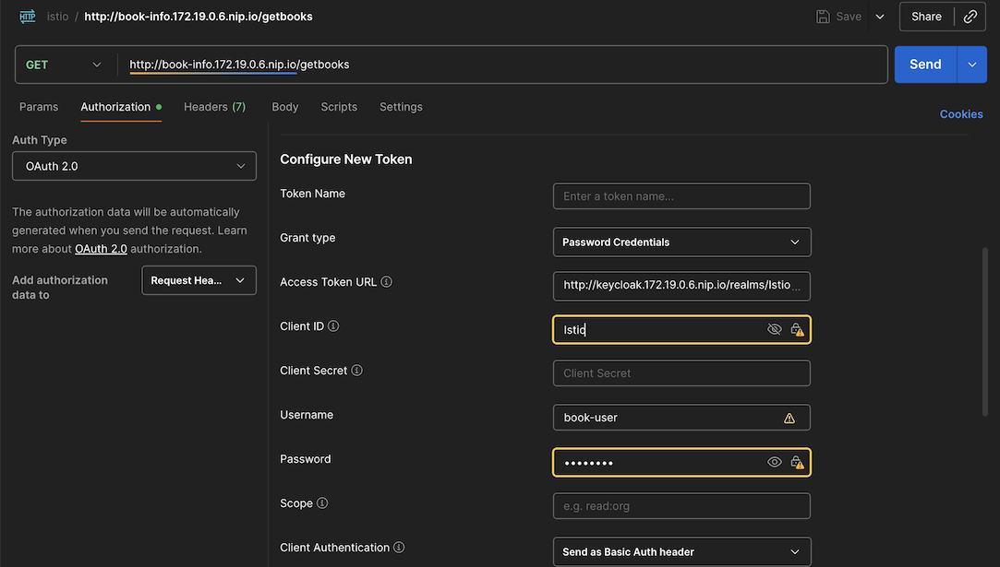

現在，讓我們嘗試使用 addbook 端點新增一本新書。

```sh
curl -X POST -d '{"isbn": 123456789123, "title": "Test Book 1", "synopsis": "This is test book 1", "authorname": "test-author1", "price": 10.39}' "http://book-info.172.19.0.6.nip.io/addbook"
RBAC: access denied
```

 由於訪問被拒絕，添加新書失敗。現在，我們將為 book-user 產生一個令牌，並嘗試新增這本書。

```sh
curl -X POST -d "client_id=Istio" -d "username=book-user" -d "password=YOUR_PASSWD" -d "grant_type=password" "http://keycloak.172.19.0.6.nip.io/realms/Istio/protocol/openid-connect/token"
{"access_token":"*****","expires_in":300,"refresh_expires_in":1800,"refresh_token":"*****","token_type":"Bearer","not-before-policy":0,"session_state":"ccbf94e1-b3c1-4260-8ade-cb0d778b8235","scope":"profile email"}
```
```sh
curl -X POST -H "Authorization: Bearer *****" -d '{"isbn": 123456789123, "title": "Test Book 1", "synopsis": "This is test book 1", "authorname": "test-author1", "price": 10.39}' "http://book-info.172.19.0.6.nip.io/addbook"
{
    "isbn": 123456789123,
    "title": "Test Book 1",
    "synopsis": "This is test book 1",
    "authorname": "test-author1",
    "price": 10.39
}
```

 如你所見，我們可以添加書籍了。同樣，你也可以使用 book-admin 使用者來加入書籍。

#### 目前設定安全問題

在我們目前的設定中，book-user 和 book-admin 使用者都可以新增書籍，但應只有 book-admin 可以新增書籍。而 book-user 只能查看書籍，而不能增加書籍。

 我們可以透過從原始 JWT 聲明資料中提取角色，並在授權策略中使用條件，來限制特定端點對特定使用者/角色的存取。現在，讓我們看看如何使用 Istio 授權策略控制更細粒度的存取。

我們將修改授權策略，僅允許 book-admin 使用者存取 /addbook 端點，並允許所有使用者存取 /getbooks 端點，內容為AuthorizationPolicy/authorizationPolicy2.yaml。

```sh
kubectl apply -f - <<EOF
apiVersion: security.istio.io/v1beta1
kind: AuthorizationPolicy
metadata:
  name: book-info-auth
spec:
  selector:
    matchLabels:
      app: book-info
  rules:
  - to:
    - operation:
       methods: ["GET"]
       paths: ["/bookdetails"]

  - from:
    - source:
        requestPrincipals: ["*"]
    to:
    - operation:
        methods: ["GET"]
        paths: ["/getbooks", "/getbookbytitle*"]

  - from:
    - source:
        requestPrincipals: ["*"]
    to:
    - operation:
        methods: ["POST"]
        paths: ["/addbook*"]
    when:
    - key: request.auth.claims[realm_access][roles]
      values: ["admin"]
EOF
authorizationpolicy.security.istio.io/book-info-auth configured
```
 
現在我們將嘗試使用 book-user 使用者新增一本新書。

```sh
curl -X POST -d "client_id=Istio" -d "username=book-user" -d "password=YOUR_PASSWD" -d "grant_type=password" "http://keycloak.172.19.0.6.nip.io/realms/Istio/protocol/openid-connect/token"
{"access_token":"*****","expires_in":300,"refresh_expires_in":1800,"refresh_token":"*****","token_type":"Bearer","not-before-policy":0,"session_state":"9fb6bcc9-57b9-4eda-8052-71daeb887b92","scope":"profile email"}
```
```sh
curl -X POST -H "Authorization: Bearer *****" -d '{"isbn": 123456789125, "title": "Test Book 3", "synopsis": "This is test book 3", "authorname": "test-author3", "price": 10.39}' "http://book-info.172.19.0.6.nip.io/addbook"
RBAC: access denied
```

這次我們不允許使用 book-user 新增書籍，因為我們只允許具有管理員角色的使用者新增書籍。
現在我們將檢查使用 admin-user 使用者新增一本書。

```sh
curl -X POST -d "client_id=Istio" -d "username=book-admin" -d "password=YOUR_PASSWD" -d "grant_type=password" "http://keycloak.172.19.0.6.nip.io/realms/Istio/protocol/openid-connect/token"
{"access_token":"*****","expires_in":300,"refresh_expires_in":1800,"refresh_token":"*****","token_type":"Bearer","not-before-policy":0,"session_state":"a9d5398a-1e7d-4cbb-a4bf-8b7bdd70f75e","scope":"profile email"}
```
```sh
curl -X POST -H "Authorization: Bearer *****" -d '{"isbn": 123456789125, "title": "Test Book 3", "synopsis": "This is test book 3", "authorname": "test-author3", "price": 10.39}' "http://book-info.172.19.0.6.nip.io/addbook"
{
    "isbn": 123456789125,
    "title": "Test Book 3",
    "synopsis": "This is test book 3",
    "authorname": "test-author3",
    "price": 10.39
}
```

我們可以使用 book-admin 使用者新增書籍，因為我們只允許具有管理員角色的使用者新增書籍，並且我們已經在 Keycloak 中為 book-admin 使用者指派了管理員角色。此外，由於我們允許任何擁有有效 JWT 令牌的使用者存取 /getbooks 端點，因此這兩個使用者都可以查看書籍。

Istio 的請求身份驗證和授權功能與 Keycloak 一起為您的應用程式提供了出色的請求級別身份驗證和授權機制 - 這是原生 Kubernetes 所缺少的。

## 請求級別身份驗證和授權的最佳實踐

保護您的應用程式免受未經授權的存取是一項基本要求，但是，實現它需要付出巨大的努力。如果您打算這樣做，以下針對請求級身份驗證和授權的最佳實踐和注意事項將對您有所幫助：

- 始終使用 SSL 或 TLS 憑證保護應用程式中的端點。 TLS 透過加密傳輸中的消息來保護您的應用程序，因為只有接收者才擁有解密的金鑰。
- 選擇適合您要求的身份驗證提供程序，並始終使用帶有 OpenID Connect 的 OAuth2 進行請求級別身份驗證。
- 確保為不同的 API 端點使用不同的權限/角色。您可以在身分驗證提供者中建立一組權限和角色，並使用它們對應用程式 API 端點進行細粒度的存取控制。
- 確定何時使用請求層級的身份驗證和授權。您無需對每個請求都進行身份驗證和授權。您的應用程式可能包含一些需要公開存取的 API 端點，例如 /healthz、/ping 或 /public，因此請謹慎選擇要保護的端點。

# 進階 Istio 服務網格 mTLS + JWT 雙重認證模式安全防護

基於本專案的實際實施經驗，描述了在 Istio 平台中採用 **mTLS + JWT 雙重認證模式** 的完整安全架構，這是目前在 Istio 中防止惡意程式入侵擴散最有效的深度防禦策略。

## 🏗️ 專案架構概述

```
┌─────────────────┐    mTLS+JWT    ┌─────────────────┐    mTLS+JWT    ┌─────────────────┐
│   Client Apps   │ ──────────────→│  Istio Gateway  │──────────────→│ Greeting Service│
└─────────────────┘                └─────────────────┘                │  (REST API)     │
                                            │                        └─────────────────┘
                                            │                                 │
                                            ▼                                 │ mTLS+JWT
                                   ┌─────────────────┐                        │
                                   │    Keycloak     │                        ▼
                                   │  (JWT Issuer)   │                ┌─────────────────┐
                                   └─────────────────┘                │   Book Service  │
                                                                      │  (Backend API)  │
                                                                      └─────────────────┘
                                                                              │
                                                                              ▼
                                                                      ┌─────────────────┐
                                                                      │   MySQL DB      │
                                                                      │  (Data Store)   │
                                                                      └─────────────────┘
```

**服務調用流程**：
1. **Client → Gateway**: 用戶端可直接或透過 JWT token 請求 Greeting Service(authorization-policy-enhanced.yaml修改其註解53~98行，就可啟用Greeting的JWT授權政策)
2. **Gateway → Greeting**: Istio Gateway 路由請求到 Greeting Service (REST API 層)
3. **Greeting → Book**: Greeting Service 透過 mTLS + JWT 雙重認證調用 Book Service
4. **Book → MySQL**: Book Service 處理業務邏輯並存取資料庫

**專案實施背景**：
- **架構**: Spring Boot 3.5.4 + Istio Service Mesh + Keycloak + Kind Kubernetes
- **應用場景**: book-info系統的請求級身份驗證與授權
- **核心特性**: mTLS + JWT 雙重認證、細粒度授權策略、GraalVM Native Image 支持
- **安全特色**: 防入侵橫向擴散、Spring Boot Actuator 端口分離、JWT Audiences 控制

## 推薦方案：mTLS + JWT 雙重認證架構

### 核心設計原理

**第一層防護：mTLS基礎身份驗證**
Istio自動將所有代理間的流量升級為相互TLS，確保服務間通訊的基礎安全。

**第二層防護：JWT應用層授權**
JWT認證可以與mTLS認證結合使用，當JWT用作代表終端調用者的憑證，且被請求的服務需要證明它是代表終端調用者被調用時，採用Client Credentials Flow。

### 1. 強制 mTLS 模式步驟

全面啟用mTLS雙向加密，內容為PeerAuthentication/peer-authentication.yaml。

```yaml
# Global STRICT mTLS for all services in the mesh
apiVersion: security.istio.io/v1
kind: PeerAuthentication
metadata:
  name: default
  namespace: istio-system
spec:
  mtls:
    mode: STRICT
---
# Namespace-specific mTLS for default namespace (optional, inherits from global)
apiVersion: security.istio.io/v1
kind: PeerAuthentication
metadata:
  name: default
  namespace: default
spec:
  mtls:
    mode: STRICT
```

先執行 verify-mtls.sh 來確認目前加密狀況：
```sh
❯ ./PeerAuthentication/verify-mtls.sh

==================================
    Istio mTLS 驗證腳本
==================================

[INFO] 檢查先決條件...
[SUCCESS] 先決條件檢查通過

[INFO] 檢查 PeerAuthentication 政策...
[INFO] 檢查全域 PeerAuthentication...
[ERROR] 全域 PeerAuthentication 未找到
[ERROR] 沒有 PeerAuthentication 政策時，Istio 預設允許明文通信
[INFO] 檢查 default namespace PeerAuthentication...
[WARNING] default namespace PeerAuthentication 未設定，且無全域政策
[INFO] PeerAuthentication 政策摘要:
  - 全域政策: false (模式: N/A)
  - default namespace 政策: false (模式: N/A)
  - 整體 mTLS 狀態: NONE
...
[INFO] 生成 mTLS 驗證摘要報告...

==================================
       mTLS 驗證摘要報告
==================================

📊 mTLS 狀態概覽：
  ├─ 整體狀態: NONE
  ├─ 預期行為: 僅允許明文連接（無加密）
  ├─ 全域政策: false (N/A)
  └─ default NS 政策: false (N/A)

🚨 安全性評估: 不足
   ❌ 缺少 mTLS 保護
   ❌ 服務間通信未加密
   🚨 風險：可能遭受中間人攻擊

🔧 立即行動項目：
   1. 部署 PeerAuthentication 政策
   2. 確保所有 pod 注入 Istio sidecar
   3. 測試應用程式與 mTLS 的兼容性

📋 檢查項目:
  ✓ 先決條件檢查
  ✓ PeerAuthentication 政策分析
  ✓ Istio proxy 狀態檢查
  ✓ mTLS 配置驗證
  ✓ 連接行為測試
  ✓ 證書狀態檢查

💡 建議事項：
  • 🚨 緊急：立即部署 PeerAuthentication
  • 確認所有服務注入 Istio sidecar
  • 規劃 mTLS 啟用策略
  • 確保所有服務都已注入 Istio sidecar
  • 監控 Istio proxy 狀態確保配置同步
  • 定期檢查證書的有效期

詳細信息請參考上方的檢查輸出
[ERROR] mTLS 驗證完成！狀態：無保護 (安全性不足)
[ERROR] 緊急：需要部署 PeerAuthentication 政策
[INFO] 清理測試資源...
[SUCCESS] 測試資源已清理
```

啟用Istio mTLS雙向加密網：

```sh
kubectl apply -f PeerAuthentication/peer-authentication.yaml
```

再次執行 verify-mtls.sh 來確認目前加密狀況：
```sh
❯ ./PeerAuthentication/verify-mtls.sh

==================================
    Istio mTLS 驗證腳本
==================================

[INFO] 檢查先決條件...
[SUCCESS] 先決條件檢查通過

[INFO] 檢查 PeerAuthentication 政策...
[INFO] 檢查全域 PeerAuthentication...
[SUCCESS] 全域 PeerAuthentication 存在，模式: STRICT
[SUCCESS] 全域 mTLS 設定為 STRICT 模式
[INFO] 檢查 default namespace PeerAuthentication...
[SUCCESS] default namespace PeerAuthentication 存在，模式: STRICT
[INFO] PeerAuthentication 政策摘要:
  - 全域政策: true (模式: STRICT)
  - default namespace 政策: true (模式: STRICT)
  - 整體 mTLS 狀態: STRICT

[INFO] 檢查 Istio proxy 狀態..
...
[INFO] 生成 mTLS 驗證摘要報告...

==================================
       mTLS 驗證摘要報告
==================================

📊 mTLS 狀態概覽：
  ├─ 整體狀態: STRICT
  ├─ 預期行為: 僅允許 mTLS 加密連接
  ├─ 全域政策: true (STRICT)
  └─ default NS 政策: true (STRICT)

🔐 安全性評估: 優秀
   ✅ 所有服務間通信都使用 mTLS 加密
   ✅ 阻止未授權的明文連接
   ✅ 符合零信任安全原則

📋 檢查項目:
  ✓ 先決條件檢查
  ✓ PeerAuthentication 政策分析
  ✓ Istio proxy 狀態檢查
  ✓ mTLS 配置驗證
  ✓ 連接行為測試
  ✓ 證書狀態檢查

💡 建議事項：
  • 定期監控 proxy 同步狀態
  • 驗證新部署服務的 mTLS 兼容性
  • 定期檢查證書輪換
  • 確保所有服務都已注入 Istio sidecar
  • 監控 Istio proxy 狀態確保配置同步
  • 定期檢查證書的有效期

詳細信息請參考上方的檢查輸出
[SUCCESS] mTLS 驗證完成！狀態：STRICT (安全性優秀)
[INFO] 清理測試資源...
[SUCCESS] 測試資源已清理
```

### 2. 導入微服務 OAuth2 JWT應用層授權

部署rest-service，來呼叫book-info的/getbooks API，而目前需要使用JWT Token才能存取。
在 *GreetingController.java* 中實作 Greeting Service → Book Service 的程式，並且透過 *OAuth2Config.java* 採用 spring-boot-starter-oauth2-client 套件，自動取得JWT Token。

並且在 *application.properties*，加上client-id和client-secret，這在[Keycloak Client Credentials Flow](#keycloak-client-credentials-flow)步驟已有設定，請複製Credentials貼到client-secret。

```
# OAuth2 Client Credentials configuration for Keycloak
spring.security.oauth2.client.registration.keycloak.client-id=client
spring.security.oauth2.client.registration.keycloak.client-secret=G1ubsAhCLcwKNgE6J7oGOQtj6kRWZsYm
spring.security.oauth2.client.registration.keycloak.authorization-grant-type=client_credentials
spring.security.oauth2.client.registration.keycloak.scope=openid
```

部署rest-service程式：

```sh
❯ kubectl apply -f PeerAuthentication/greeting-service.yml
deployment.apps/greeting-deployment created
service/greeting-service created
gateway.networking.istio.io/greeting-gateway created
virtualservice.networking.istio.io/greeting-vs created
```

確認部署完成且可正常運作：

```sh
curl -X GET http://greeting.172.19.0.6.nip.io/
welcome v2%
```

接著驗證 Greeting Service → Book Service 是否正常運作，呼叫/greeting API：

```sh
❯ curl -X GET http://greeting.172.19.0.6.nip.io/greeting
{"id":1,"content":"Hello, authenticated Member! We have 3 books available for you."}%
```

結果顯示取得三本書籍，表示Client Credentials Flow已經正常，直接呼叫 book-info /getbooks則出現 access denied錯誤：
```sh
curl -X GET http://book-info.172.19.0.6.nip.io/getbooks
RBAC: access denied%
```

#### 啟用增強式請求身份驗證

原先[請求身份驗證](#%E5%95%9F%E7%94%A8%E8%AB%8B%E6%B1%82%E8%BA%AB%E4%BB%BD%E9%A9%97%E8%AD%89)，並沒有指定audiences: ["client", "api-client"]，而PeerAuthentication/request-authentication-enhanced.yaml則有指定，內容如下：

```yaml
apiVersion: security.istio.io/v1beta1
kind: RequestAuthentication
metadata:
  name: book-info-request-authentication
  namespace: default
spec:
  selector:
    matchLabels:
      app: book-info
  jwtRules:
  - issuer: "http://keycloak.172.19.0.6.nip.io/realms/Istio"
    jwksUri: "http://keycloak.172.19.0.6.nip.io/realms/Istio/protocol/openid-connect/certs"
    audiences: ["client", "api-client"] #需要參考如何在 Keycloak 中配置aud
    forwardOriginalToken: true
```

使用指定audiences的RequestAuthentication：

```sh
❯ kubectl apply -f PeerAuthentication/request-authentication-enhanced.yaml
```

接著驗證 Greeting Service → Book Service 是否正常運作，呼叫/greeting API：

```sh
❯ curl -X GET http://greeting.172.19.0.6.nip.io/greeting
{"id":4,"content":"Sorry, we couldn't retrieve book information at the moment. Authentication or service error occurred."}% 
```

顯示認證錯誤訊息，表示Client Credentials認證失敗，因為目前Keycloak配發的JWT Token缺少aud參數。

取得目前JWT Token，複製access_token內容，貼到jwt.io網站解析：
```sh
❯ curl -X POST -d "client_id=client" -d "client_secret=G1ubsAhCLcwKNgE6J7oGOQtj6kRWZsYm" -d "grant_type=client_credentials" "http://keycloak.172.19.0.6.nip.io/realms/Istio/protocol/openid-connect/token"
{"access_token":"eyJhbGciOiJSUzI1NiIsInR5cCIgOiAiSldUIiwia2lkIiA6ICJlY0VRZjNUNDhNeTVUME1jUlpIV0QxSWx1ZzlJNDNnUzlSeTFWekpER0tBIn0.eyJleHAiOjE3NTQ4OTE2MDYsImlhdCI6MTc1NDg5MTMwNiwianRpIjoidHJydGNjOjU1ODk0YTFhLTNlZmQtNmQxNy0yNDRkLWZjOWQxNGIxZDY1YSIsImlzcyI6Imh0dHA6Ly9rZXljbG9hay4xNzIuMTkuMC42Lm5pcC5pby9yZWFsbXMvSXN0aW8iLCJzdWIiOiI1MDk5ZWE0MS1mNzFiLTRjNzMtYTBhMy04ZjQyMDRiY2FjNGEiLCJ0eXAiOiJCZWFyZXIiLCJhenAiOiJjbGllbnQiLCJhY3IiOiIxIiwiYWxsb3dlZC1vcmlnaW5zIjpbIi8qIl0sInJlYWxtX2FjY2VzcyI6eyJyb2xlcyI6WyJhZG1pbiJdfSwic2NvcGUiOiJlbWFpbCBwcm9maWxlIiwiY2xpZW50SG9zdCI6IjE3Mi4xOS4wLjUiLCJlbWFpbF92ZXJpZmllZCI6ZmFsc2UsInByZWZlcnJlZF91c2VybmFtZSI6InNlcnZpY2UtYWNjb3VudC1jbGllbnQiLCJjbGllbnRBZGRyZXNzIjoiMTcyLjE5LjAuNSIsImNsaWVudF9pZCI6ImNsaWVudCJ9.Vwdu9r4XQ3GbQkCBqvCwv--RAql9OPiLe1VhUBkT2yiz0JDfwxn0CL41vGVehpPxiVJfc_mmUcbh29ZrDpnOkxrDUZy0vq09rcVZzpB3ZTHYhM3pyguJJeT-TSXE60p5fCunR2I7vr1jbKT4mgjgw2ThovPi15FqxSYshmlTv7aCoqHINQskz1IGxfyjEk2IFsqP4xg3XPpuGcXuIkN8K8MIMpSMczIa4Vp3CrMo8jKfUZVbZR1dT7WfBCdlMQOgDyeX6AouX0NCG9-nHTO5uK5Sh4Nyrw9C-Op-AcKT2JxsMxtWlIa3CDvcEG3xR176z6Jkam3Q6V8DnM6jM1cjZw","expires_in":300,"refresh_expires_in":0,"token_type":"Bearer","not-before-policy":0,"scope":"email profile"}%
```

解析發現，其中並沒有aud的欄位，見下圖：
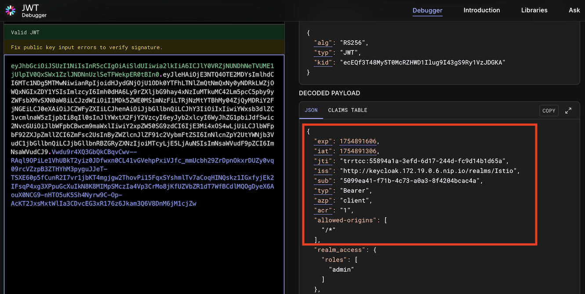

##### 創建 Audience aud 欄位

因此，依照[How To Configure Audience In Keycloak](https://dev.to/metacosmos/how-to-configure-audience-in-keycloak-kp4)文章，增加Audience對應。

建立自定義對應欄位

- 在左側窗格中選擇"Client scope"，然後點選"Create client scope"按鈕，名稱輸入"untrusted-audience"。
- Type選擇"Default"，接著按"Save"儲存。

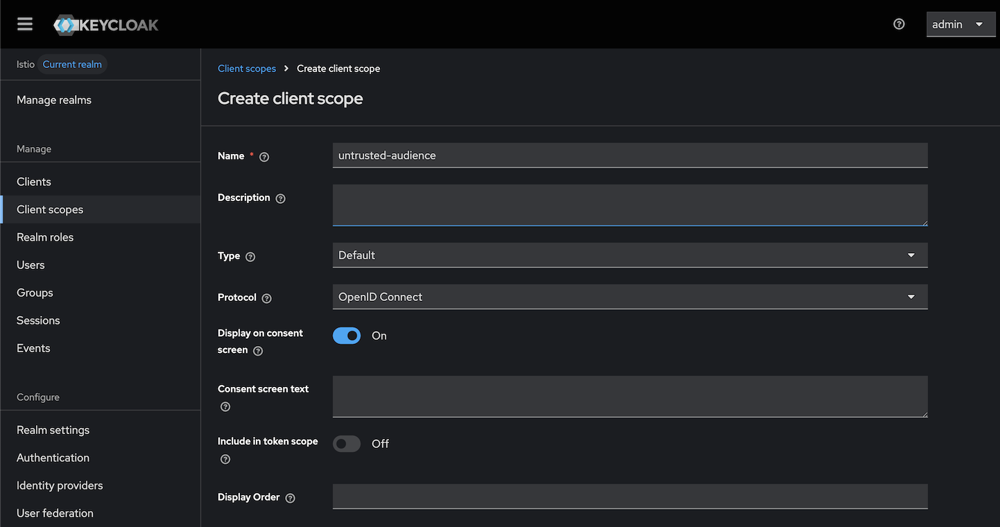

- 再按下"Mappers"頁籤，按"Configure a new mapper"按鈕，選擇Audience。
- 名稱輸入"greeting-service"，接著按"Save"儲存。

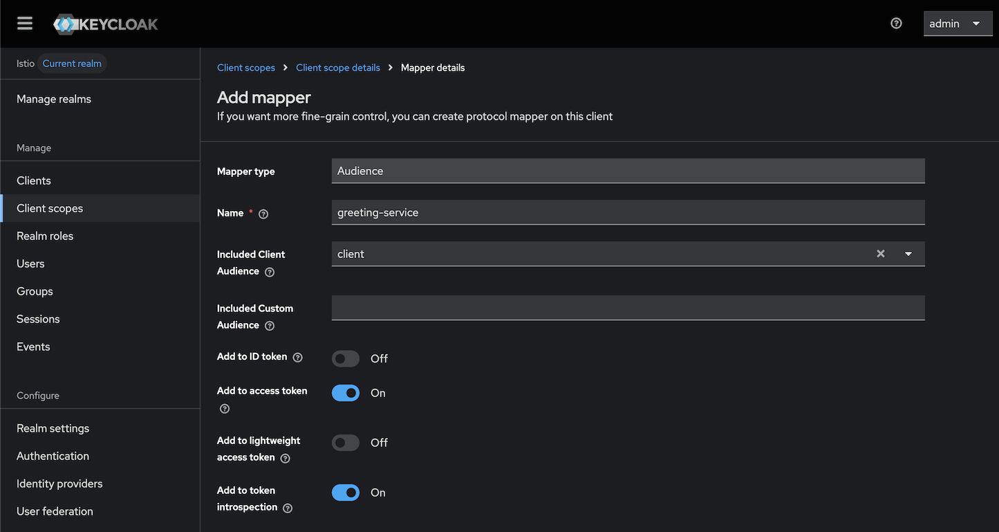

- 在左側窗格中選擇"Clients"，選擇"client"，再按下"Client scope"頁籤，按下"Add client scope"按鈕。
- 勾選"untrusted-audience"，按下"Add"按鈕，選擇"Default"。

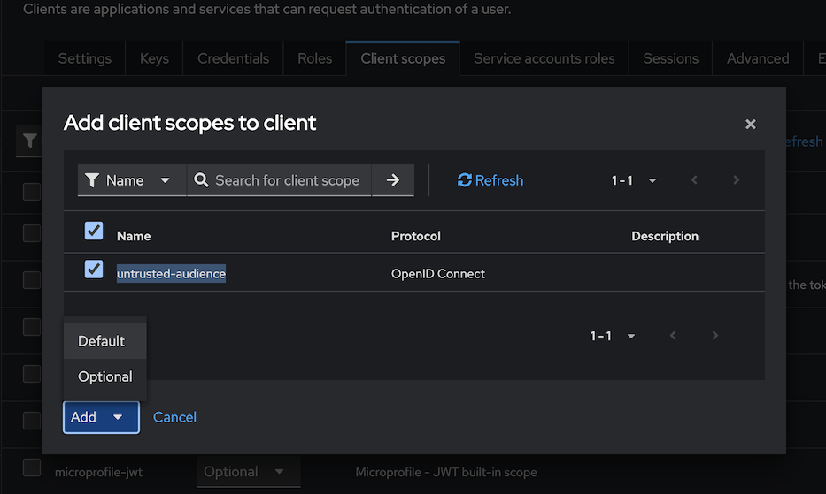

再次取得目前JWT Token，複製access_token內容，貼到jwt.io網站解析：

```sh
❯ curl -X POST -d "client_id=client" -d "client_secret=G1ubsAhCLcwKNgE6J7oGOQtj6kRWZsYm" -d "grant_type=client_credentials" "http://keycloak.172.19.0.6.nip.io/realms/Istio/protocol/openid-connect/token"
{"access_token":"eyJhbGciOiJSUzI1NiIsInR5cCIgOiAiSldUIiwia2lkIiA6ICJlY0VRZjNUNDhNeTVUME1jUlpIV0QxSWx1ZzlJNDNnUzlSeTFWekpER0tBIn0.eyJleHAiOjE3NTQ4OTMxNTUsImlhdCI6MTc1NDg5Mjg1NSwianRpIjoidHJydGNjOmI2M2QwYjdiLTJmNGYtN2Y1NS1kZjBhLWE3Yjc2MThhY2EzYiIsImlzcyI6Imh0dHA6Ly9rZXljbG9hay4xNzIuMTkuMC42Lm5pcC5pby9yZWFsbXMvSXN0aW8iLCJhdWQiOiJjbGllbnQiLCJzdWIiOiI1MDk5ZWE0MS1mNzFiLTRjNzMtYTBhMy04ZjQyMDRiY2FjNGEiLCJ0eXAiOiJCZWFyZXIiLCJhenAiOiJjbGllbnQiLCJhY3IiOiIxIiwiYWxsb3dlZC1vcmlnaW5zIjpbIi8qIl0sInJlYWxtX2FjY2VzcyI6eyJyb2xlcyI6WyJhZG1pbiJdfSwic2NvcGUiOiJlbWFpbCBwcm9maWxlIiwiY2xpZW50SG9zdCI6IjEwLjI0NC4xLjEiLCJlbWFpbF92ZXJpZmllZCI6ZmFsc2UsInByZWZlcnJlZF91c2VybmFtZSI6InNlcnZpY2UtYWNjb3VudC1jbGllbnQiLCJjbGllbnRBZGRyZXNzIjoiMTAuMjQ0LjEuMSIsImNsaWVudF9pZCI6ImNsaWVudCJ9.lbfjGhgP_gk-PgfG0Rv5Me7wqaIxLpVgYmGgHmGyiAg4CRaSaAXOeTMxJ79lqe7hlbWIO6EveoxEUjlbmma-6ATjFJ31HxkW_7Wv_gzFJk38M2OQaI-QAn63lQk50OfgP1DHXuN4INbtjIEkgaxOQCzOqFILCmAtA5nXaglgEPxxWw7umSpFh2P6WWLxB-V7YmlzRS-vrgE16VL4hmnmNDDHkzx9M-jPP8BpGRqudooppWsYjGG6RJ8jOcZmX4v_bbZ_qRcIJ__YkedXMj2zDyNrdzOWYcloNyQwgPaujhkVi4UeQwtPYzXtJ9VAgfiHXcf0dL_xMIsWhLYi0r9gag","expires_in":300,"refresh_expires_in":0,"token_type":"Bearer","not-before-policy":0,"scope":"email profile"}% 
```


可看到已經有aud欄位，此時再呼叫/greeting API，可看到Greeting Service → Book Service 已恢復正常運作：

```sh
❯ curl -X GET http://greeting.172.19.0.6.nip.io/greeting
{"id":1,"content":"Hello, authenticated Member! We have 3 books available for you."}%
```

### 3. 啟用 K8s service account 來源驗證

Istio可實現細粒度授權政策，用於防止內部服務橫向惡意攻擊，以下是啟用加上service account來源驗證和Audience aud 欄位驗證的授權政策，內容為AuthorizationPolicy/authorization-policy-enhanced.yaml

```yaml
# Enhanced AuthorizationPolicy for book-info service with mTLS + JWT dual authentication
apiVersion: security.istio.io/v1
kind: AuthorizationPolicy
metadata:
  name: book-info-enhanced-auth
  namespace: default
spec:
  selector:
    matchLabels:
      app: book-info
  action: ALLOW
  rules:
  # Rule 1: Allow access to /getbooks with valid JWT from authenticated services
  - from:
    # - source:
    #     principals: ["cluster.local/ns/default/sa/greeting-service"]
    # - source:
    #     requestPrincipals: ["*"]
  # Rule 2: Allow access to /addbook only for admin role with both mTLS and JWT
    - source:
        principals: ["cluster.local/ns/default/sa/greeting-service"]
        requestPrincipals: ["*"]
    to:
    - operation:
        methods: ["GET"]
        paths: ["/getbooks", "/getbookbytitle*"]
    when:
    - key: request.auth.claims[aud]
      values: ["client", "api-client"]
  
  # Rule 2: Allow access to /addbook only for admin role with both mTLS and JWT
  - from:
    - source:
        principals: ["cluster.local/ns/default/sa/greeting-service"]
        requestPrincipals: ["*"]
    to:
    - operation:
        methods: ["POST"]
        paths: ["/addbook*"]
    when:
    - key: request.auth.claims[realm_access][roles]
      values: ["admin"]
    - key: request.auth.claims[aud]
      values: ["client", "api-client"]
  
  # Rule 3: Allow health checks without authentication (for monitoring)
  - to:
    - operation:
        methods: ["GET"]
        paths: ["/health", "/healthz", "/actuator/health"]
```

移除舊的授權政策，並啟用細粒度授權政策：

```sh
❯ kubectl delete -f AuthorizationPolicy/authorizationPolicy2.yaml
❯ kubectl apply -f AuthorizationPolicy/authorization-policy-enhanced.yaml
```

此時用Postman呼叫http://book-info.172.19.0.6.nip.io/getbooks，就會出現RBAC: access denied錯誤，而呼叫/greeting API也會出現認證失敗訊息：

```sh
❯ curl -X GET http://greeting.172.19.0.6.nip.io/greeting
{"id":25,"content":"Sorry, we couldn't retrieve book information at the moment. Authentication or service error occurred."}%
```

主要原因是目前book-info服務限制使用greeting-service service account來存取，因此重新部署greeting-service，使用*AuthorizationPolicy/greeting-service-account.yaml*。

```sh
❯ kubectl apply -f AuthorizationPolicy/greeting-service-account.yaml
serviceaccount/greeting-service created
deployment.apps/greeting-deployment configured
service/greeting-service unchanged
gateway.networking.istio.io/greeting-gateway unchanged
virtualservice.networking.istio.io/greeting-vs unchanged
```

檢查是否有帶入service account：

```sh
❯ kubectl describe deployments.apps greeting-deployment | grep Account
  Service Account:  greeting-service
```

再次呼叫/greeting API，可看到Greeting Service → Book Service 已恢復正常運作，但是因為限定來源，Postman呼叫http://book-info.172.19.0.6.nip.io/getbooks，仍舊會出現RBAC: access denied錯誤：

```sh
❯ curl -X GET http://greeting.172.19.0.6.nip.io/greeting
{"id":1,"content":"Hello, authenticated Member! We have 3 books available for you."}%
```

## 總結：

注意事項：

### 1. AuthorizationPolicy 設定邏輯

```yaml
  # Rule 1: Allow access to /getbooks with valid JWT from authenticated services
  - from:
    - source:
        principals: ["cluster.local/ns/default/sa/greeting-service"]
    - source:
        requestPrincipals: ["*"]
  # Rule 2: Allow access to /addbook only for admin role with both mTLS and JWT
    - source:
        principals: ["cluster.local/ns/default/sa/greeting-service"]
        requestPrincipals: ["*"]
```
上面的Rule 1是OR條件，表示兩個source擇一即可，但這無法確保呼叫來源，Postman呼叫http://book-info.172.19.0.6.nip.io/getbooks就可存取，所以正確是Rule 2才是符合的AND條件。

### 與其他方案的比較

| 方案 | 入侵防護能力 | Istio整合度 | 實施複雜度 | 防護深度 |
|------|-------------|-------------|------------|----------|
| **純mTLS** | ⭐⭐⭐ | ⭐⭐⭐⭐⭐ | ⭐⭐ | ⭐⭐⭐ |
| **純JWT** | ⭐⭐ | ⭐⭐⭐⭐ | ⭐⭐⭐ | ⭐⭐ |
| **mTLS+JWT** | ⭐⭐⭐⭐⭐ | ⭐⭐⭐⭐⭐ | ⭐⭐⭐⭐ | ⭐⭐⭐⭐⭐ |
| **SPIFFE/SPIRE** | ⭐⭐⭐⭐ | ⭐⭐⭐ | ⭐⭐⭐⭐⭐ | ⭐⭐⭐⭐ |

基於本專案的實際實施經驗，mTLS + JWT 雙重認證確實是防止服務入侵橫向擴散的最佳選擇。通過正確配置 AND 邏輯、ServiceAccount 管理、JWT Audiences 控制和 Spring Boot 端口分離，可以構建一個真正安全、可靠的微服務架構。配合 Istio 的 AuthorizationPolicy，實現了毫秒級的動態威脅隔離，是企業級微服務安全的理想選擇。

## 🚀 快速開始

### 前置需求

- Docker Desktop 或 Podman
- Kind (Kubernetes in Docker)  
- kubectl
- istioctl(可選)

### 一鍵部署

```bash
# 1. 建立 Kind 集群
kind create cluster --config istio-keycloak/kind.yml

# 2. 安裝 Istio
istioctl install --set profile=demo -y
```

### 驗證部署

```bash
# 檢查 pods 狀態
kubectl get pods

# 驗證 mTLS 狀態
istioctl proxy-status

# 測試 API 端點
export LB_IP=$(kubectl get svc istio-ingressgateway -o jsonpath='{.status.loadBalancer.ingress[0].ip}' -n istio-system)
curl -X GET "http://$LB_IP/getbooks"
```

## 📚 文檔結構

```
docs/
├── guide.md           # Istio 服務網格安全防護指南
├── istio_m2m.md      # Machine to Machine API 權限管制設計  
├── mTLS_JWT.md       # mTLS + JWT 雙重認證分析與最佳實踐
└── README.md         # 本文件
```

## 🔧 開發命令

### 應用構建

```bash
# JVM 版本構建
./mvnw clean package
./mvnw spring-boot:run -Dspring-boot.run.profiles=dev

# Native Image 構建
./mvnw spring-boot:build-image -Pnative -DskipTests

# 測試
./mvnw test
```

### Istio 操作

```bash
# 分析配置
istioctl analyze

# 檢查代理配置
istioctl proxy-config cluster <pod-name>

# 查看授權策略
istioctl proxy-config authz <pod-name>
```

### 故障排除

```bash
# 檢查應用日誌
kubectl logs -l app=book-info -c book-info

# 檢查 Istio sidecar 日誌  
kubectl logs -l app=book-info -c istio-proxy

# 檢查 Keycloak 狀態
kubectl get svc -l app=keycloak
```

## 🛡️ 安全最佳實踐

1. **Always use HTTPS/TLS** in production environments
2. **Implement proper JWT audience validation** to prevent token misuse  
3. **Use dedicated ServiceAccounts** for each microservice
4. **Monitor and audit authorization decisions** through Istio telemetry
5. **Regularly rotate JWT signing keys** in Keycloak
6. **Apply principle of least privilege** in AuthorizationPolicies

## 參考網站

- [InfraCloud](https://www.infracloud.io/blogs/request-level-authentication-authorization-istio-keycloak/) 提供原始教學內容

---

**⚠️ 重要提醒**: 本專案僅供學習和開發使用。生產環境部署前請確保：
- 更新所有預設密碼和金鑰
- 使用 HTTPS/TLS 加密所有外部通信
- 實施適當的監控和告警機制
- 定期進行安全審計和漏洞掃描